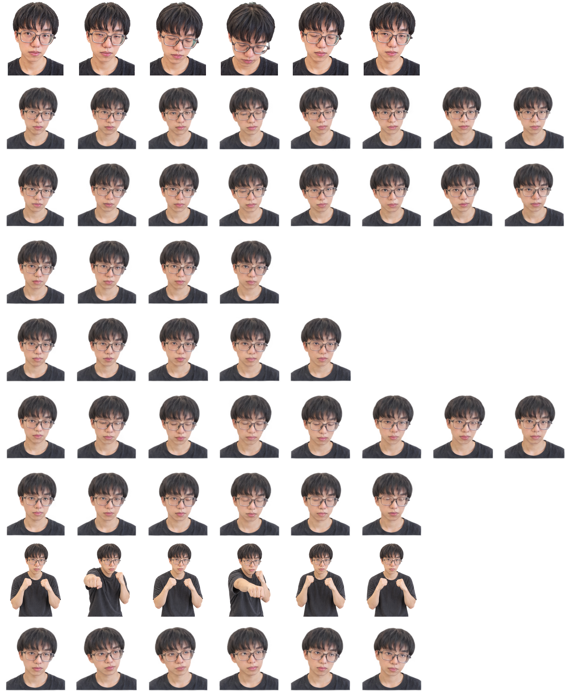

# 华 · Codex Pet

“华”是一个照片质感的 Codex 桌面宠物：平时闭眼点头犯困，忙碌时会抬拳出拳。

<p align="center">
  
</p>

## 兼容性

- Codex 自定义宠物 v1
- 8 列 × 9 行动画图集
- 单格尺寸：192 × 208 px
- 图集尺寸：1536 × 1872 px

## 安装

1. 退出 Codex。
2. 将整个 `sleepy-boxer` 文件夹复制到 Codex 的宠物目录：
   - macOS / Linux：`~/.codex/pets/`
   - Windows：`%USERPROFILE%\.codex\pets\`
3. 重新打开 Codex，在宠物选择器中选择“华”。

更详细的中文说明见 [README-Install.zh-CN.md](README-Install.zh-CN.md)。

## 文件

- `sleepy-boxer/pet.json`：宠物元数据
- `sleepy-boxer/spritesheet.png`：透明动画图集
- `validation.json`：图集结构校验结果
- `SHA256SUMS.txt`：发布文件完整性校验值

校验文件：

```bash
shasum -a 256 -c SHA256SUMS.txt
```

## 制作类似桌宠

仓库内提供了可安装的 Codex 技能：[codex-pet-maker](skills/codex-pet-maker/SKILL.md)。它包含 v1/v2 图集规范、逐行动画提示方法、方向动画规则和质量检查清单。

安装技能：

```bash
cp -R skills/codex-pet-maker ~/.codex/skills/
```

重新打开 Codex 后，可以这样调用：

```text
使用 $codex-pet-maker，根据我的角色描述或参考图制作一个可安装的 Codex 动画桌宠。
```

制作流程概览：

1. 准备角色概念或有权使用的参考图，确定名称、风格和标志性动作。
2. 先生成一张角色基准图，锁定脸、服装、配色、材质和比例。
3. 按状态逐行制作动画，不让图像模型一次生成整张最终图集。
4. 用确定性的图像处理方式切帧、透明化、统一缩放并组装图集。
5. 检查透明度、身份一致性、动作语义、方向与循环连续性。
6. 生成 `pet.json`，与图集一起复制到 Codex 的 `pets` 目录。

新桌宠建议使用 v2：8 列 × 11 行、单格 `192×208`、总尺寸 `1536×2288`，并设置 `spriteVersionNumber: 2`。本仓库的“华”是 v1 兼容示例。

## 许可证

本项目使用 MIT 许可证，详见 [LICENSE](LICENSE)。
